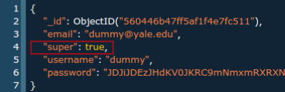

Users
=====

Registering
-----------

When a user registers from the provided login page, their credentials
are added to the database, but they don't get privileges to the private data.
That has to be added manually through the mongo shell or
the mongo-express interface.

To give a user privileges, either

* run the commands inside the mongo shell  
```
> use gene_locale  
> db.users.update({username: {USERNAME}}, {$set: {super: true}})
```
* Manually edit the user's entry from mongo-express
        

    